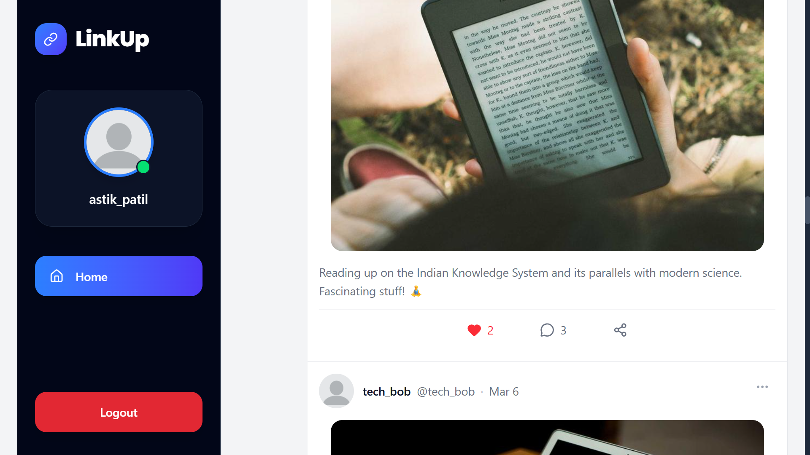
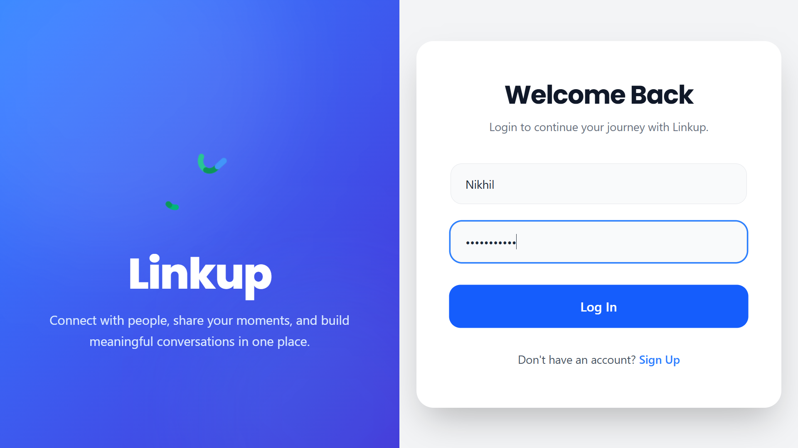
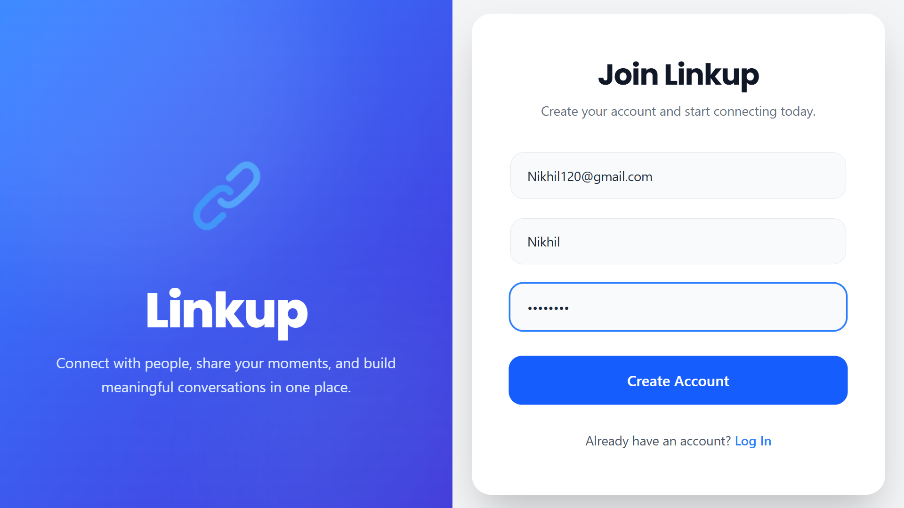
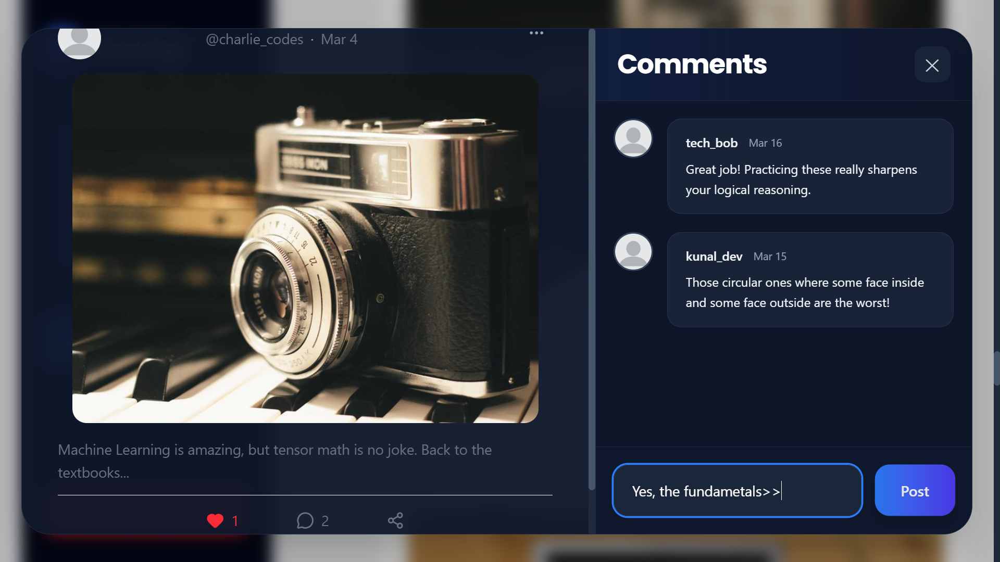
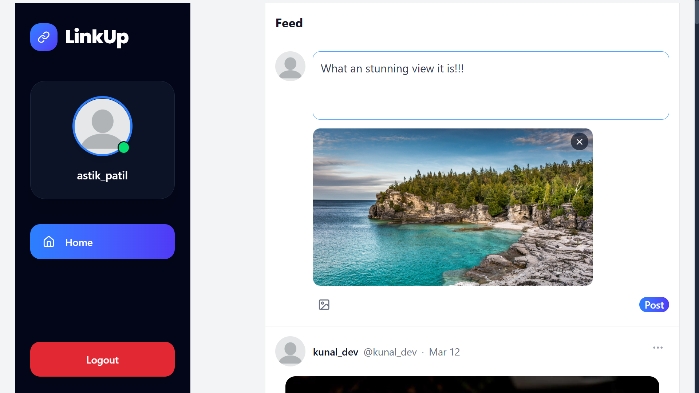

# 🚀 LinkUp — Social Media Platform

## 📌 Overview
LinkUp is a full-stack social media web application developed as a Minor Project by a team of 4 members. The platform allows users to create accounts, log in, create posts, interact with feeds, and explore social connectivity through a modern, responsive user interface.

---

## ✨ Features
*   **User Authentication:** Secure Login and Signup functionality.
*   **Modern UI:** Clean, responsive design built with Tailwind CSS.
*   **Social Feed:** Interactive feed for viewing shared content.
*   **Create Post System:** Easy-to-use interface for publishing new posts.
*   **Sidebar Navigation & Rightbar Suggestions:** Intuitive layout for seamless platform exploration.

---

## 🛠️ Tech Stack

### Frontend
*   **Framework:** React.js (Vite)
*   **Styling:** Tailwind CSS
*   **Icons:** Lucide React

### Backend & Database
*   **Runtime Environment:** Node.js
*   **Framework:** Express.js
*   **Database:** MongoDB

### Tools & Version Control
*   Git & GitHub

---

## 📂 Folder Structure

```bash
Linkup/
├── frontend/
│    ├── src/
│    │    ├── components/
│    │    ├── pages/
│    │    ├── services/
│    │    ├── context/
│    │    └── App.jsx
│    └── public/
│
└── backend/
     ├── routes/
     ├── controllers/
     ├── models/
     └── server.js
```
---

## ⚙️ Installation & Setup

### 1. Clone the Repository
```bash
git clone https://github.com/mahul0902/Linkup.git
cd Linkup
```

### 2. Frontend Setup
```bash
cd frontend
npm install
npm run dev
```

### 3. Backend Setup
```bash
cd backend
npm install
npm run dev
```

---

## 🔑 Environment Variables

Create a `.env` file inside the respective directories if required.

### Frontend (`frontend/.env`)

```env
VITE_API_URL=http://localhost:5000
```

### Backend (`backend/.env`)

```env
PORT=5000
MONGO_URL=your_mongodb_connection_string
```

---

## 📸 Screenshots

### Landing Page


### Login Page


### Signup Page


### Comment Page


### Post Page


---

## 👥 Team Members

| Name | Role / Contribution |
| :--- | :--- |
| **Mahul Nayak** | Backend Development |
| **Asfaan Khan** | Frontend Development |
| **Ayush Singh** | UI/UX Designing |
| **Astik Patil** | Login & Signup UI |

---

## 🚀 Future Scope
* **Real-time Features:** Integration of WebSockets for real-time chat and instant notifications.
* **Social Engagement:** Implementation of a robust like, comment, and share system.
* **Media Management:** Cloud-based image and media uploads for posts.
* **UI Optimization:** Further mobile responsiveness and accessibility improvements.

---

## 📄 License
This project is developed exclusively for academic purposes as a Minor Project.